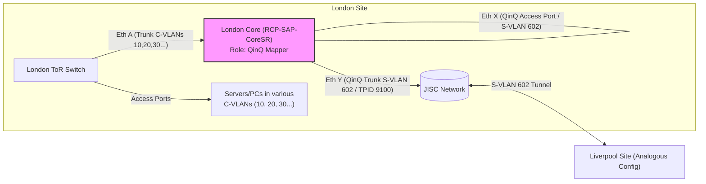

# QinQ Configuration: Core as Intermediate Mapper (Access Port Method)

## Goal

To establish a Layer 2 QinQ tunnel between the London site and the Liverpool site over the JISC ISP network, carrying **multiple production customer VLANs (C-VLANs)** trunked from the local ToR switch. This configuration uses the existing Core switch as the device performing the QinQ S-VLAN encapsulation/decapsulation, connecting to the ToR via the "QinQ Access Port Method".

**Key Parameters:**
*   **C-VLANs (Customer/Internal):** Multiple VLANs (e.g., 10, 20, 30, etc. - The specific list depends on requirements)
*   **S-VLAN (Service Provider/Tunnel):** VLAN 602 (Assigned by JISC)
*   **QinQ TPID (Tag Protocol Identifier):** 0x9100 (Required by JISC)

## Topology (Focus on London Side)



*   **ToR Switch:** Trunks the required internal C-VLANs (e.g., 10, 20, 30) to the Core. May hold the L3 SVIs for these VLANs (e.g., `interface Vlan10`, `interface Vlan20`).
*   **Core Switch (RCP-SAP-CoreSR):** Acts solely as a Layer 2 QinQ mapper for this traffic path. **MUST NOT** have active L3 SVIs (`interface Vlan10`, `interface Vlan20`, etc.) for **any** C-VLAN being tunneled. Uses the special QinQ Access Port method on the ToR-facing interface.
*   **ISP Link:** Configured as a QinQ trunk carrying the S-VLAN (602) with the specific TPID (0x9100).

## Configuration Examples

*(Note: Interface numbers are examples, adjust based on your physical connections. Replace `10,20,30` with your actual list/range of C-VLANs. Command syntax assumes Cisco-like IOS/NX-OS, adapt if using a different vendor)*

### 1. London ToR Switch Configuration

*   **Port facing Core Switch (e.g., Eth A):** This port sends standard tagged C-VLAN traffic *towards* the Core.

```
! Define the C-VLANs locally if not already done
vlan 10,20,30
  name Production_VLAN_10 ! etc.
!
interface EthernetA  // Or Port-Channel connected to Core Eth X
  description "Trunk Link to Core - Carrying Production C-VLANs"
  no shutdown
  switchport mode trunk
  switchport trunk allowed vlan 10,20,30 // *** Add ALL C-VLANs to be tunneled ***
  ! Alternatively, use ranges or 'add'/'remove' commands as appropriate
  no switchport access vlan
  ! Potentially add spanning-tree port type edge trunk or normal, depending on policy
!
```

### 2. London Core Switch (RCP-SAP-CoreSR) Configuration

*   **Global S-VLAN Definition:** Define the S-VLAN and mark it for QinQ operation.

```
! Define the S-VLAN ID provided by the ISP
interface vlan 602
  description "QinQ S-VLAN for JISC Tunnel"
  vlan-stack   ! IMPORTANT: Marks this VLAN for QinQ operations. (Syntax might be 'dot1q-tunnel' or similar on other platforms)
  no shutdown
!
```

*   **Port facing ToR Switch (e.g., Eth X - QinQ Ingress/Egress):** This uses the specific QinQ Access Port configuration. **This configuration does not need to list the C-VLANs.**

```
interface EthernetX // Connected to ToR Eth A (e.g., 1/1/35:1)
  description "Link from ToR - QinQ Ingress/Egress for S-VLAN 602"
  no shutdown
  switchport mode access       ! *** Yes, ACCESS mode ***
  switchport access vlan 602   ! *** Assign to the S-VLAN ***
  spanning-tree disable        ! Recommended for QinQ ports to avoid STP issues
  ! or potentially configure BPDU Filter/Guard depending on exact needs/vendor
!
```

*   **Port facing ISP (e.g., Eth Y - QinQ Trunk):** This is the external QinQ trunk.

```
interface EthernetY // Connected to JISC (e.g., 1/1/27:1)
  description "Link to ISP JISC - QinQ Trunk S-VLAN 602"
  no shutdown
  switchport mode trunk
  switchport trunk tpid 0x9100   ! *** TPID required by ISP ***
  switchport trunk allowed vlan 602 ! *** ONLY allow the S-VLAN ***
  mtu 9216                     ! Accommodate QinQ overhead (S-Tag = 4 bytes)
  spanning-tree disable        ! Often recommended/required on P2P ISP links
  no switchport access vlan
!
```

*   **CRITICAL Prerequisite:** Ensure the L3 interfaces for **ALL** C-VLANs being tunneled are **NOT active** on this Core switch.

```
! On the Core Switch (RCP-SAP-CoreSR)
! Ensure these interfaces do NOT exist or are shutdown for ALL C-VLANs in the tunnel (e.g., 10, 20, 30)
! no interface Vlan10
! no interface Vlan20
! no interface Vlan30
! ... etc ...
! OR
! interface Vlan10
!   shutdown
! interface Vlan20
!   shutdown
! interface Vlan30
!   shutdown
! ... etc ...
!
```

### 3. Liverpool Site Configuration

The configuration on the Liverpool Core (CS-01) and its connected ToR switch would mirror the London setup precisely, using the same S-VLAN (602) and TPID (0x9100) on the ISP-facing link, and allowing the corresponding local C-VLANs (e.g., 10, 20, 30) on the ToR-Core trunk. The Liverpool Core must also have the SVIs for these C-VLANs disabled.

## Explanation of Key Concepts

1.  **Core as L2 Mapper:** By removing/disabling the L3 SVIs (e.g., `interface Vlan10`, `Vlan20`...) on the Core for all tunneled C-VLANs, we dedicate it to Layer 2 functions for this traffic path.
2.  **ToR-Core Link (QinQ Access Port Method):**
    *   The ToR sends standard 802.1Q tagged frames (C-Tags 10, 20, 30...) over its trunk port (Eth A).
    *   The Core receives these tagged frames on its port Eth X.
    *   Because Eth X is configured as `switchport mode access`, `switchport access vlan 602`, *and* `interface Vlan 602` is marked `vlan-stack`, the switch applies special QinQ logic:
        *   **Ingress (ToR -> Core):** It accepts the incoming tagged frames (normally dropped by an access port), treats the *entire frame* (including the C-Tag) as payload, and associates it internally with S-VLAN 602. **This inherently handles multiple different C-VLAN tags transparently.**
        *   **Egress (Core -> ToR):** When traffic arrives from the ISP in S-VLAN 602 destined for Eth X, the Core removes the outer S-Tag (VLAN 602) and forwards the original inner frame (still tagged with its original C-VLAN) out Eth X towards the ToR.
    *   This `trunk -> access` setup **is valid and standard** for this specific QinQ ingress/egress method and works for multiple C-VLANs without listing them on the Core's access port configuration.
3.  **Core-ISP Link (QinQ Trunk):**
    *   Standard QinQ trunk carrying only the S-VLAN (602), using the ISP's TPID (0x9100), and with an increased MTU.

## Traffic Flow Summary

*   **London ToR -> Liverpool ToR:**
    1.  Frame (e.g., C-Tag 10) leaves London ToR Eth A.
    2.  Arrives London Core Eth X -> Associated with S-VLAN 602 (C-Tag 10 preserved).
    3.  Leaves London Core Eth Y with Outer Tag S-VLAN 602 (TPID 0x9100) + Inner Tag C-VLAN 10.
    4.  Traverses JISC network.
    5.  Arrives Liverpool Core ISP Port -> S-Tag 602 processed.
    6.  Leaves Liverpool Core ToR-facing Port (configured like London Eth X) -> S-Tag 602 stripped.
    7.  Arrives Liverpool ToR Trunk Port as Frame (C-Tag 10).
*   The same flow applies concurrently for frames tagged with C-VLAN 20, 30, etc.
*   **Liverpool ToR -> London ToR:** Reverse of the above.

This updated configuration should reflect your requirement to tunnel multiple production VLANs using this method and the corrected Mermaid syntax should render properly in compatible Markdown viewers (like GitHub).